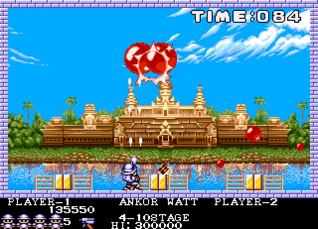
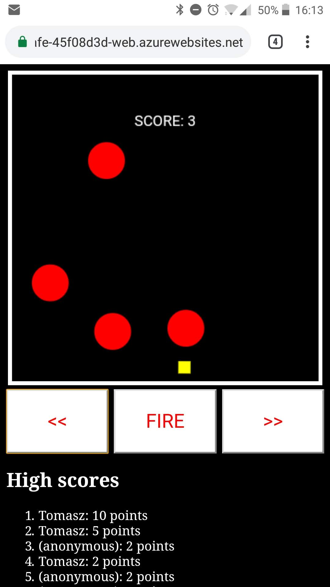

- title : 
Build a game with Fable in 45 minutes
- author : Tomasz Heimowski
- theme : night
- transition : default

***

## Build a game with Fable 
### in 45 minutes

Tomasz Heimowski http://theimowski.com

 

*@theimowski*

***

## Agenda

* What
* Why
* **Demo**
* Q&A

Slides available at 

http://theimowski.com/talk-pang-game

***

***

<iframe width="840" height="630"
src="https://www.youtube.com/embed/OeYIeaHjewU?t=9&autoplay=1">
</iframe>

***

 

***

## These are not goals

* see clean code
* praise functional purity
* admire my fast typing

***

## These are the goals

* interop with JS libraries
* use mutability to gain on performance
* see Fable in action
* have fun

***

# Starting point

* [SAFE Template](https://github.com/SAFE-Stack/SAFE-template) with [Azure App Service](https://safe-stack.github.io/docs/template-appservice/) and [Fable.Remoting](https://github.com/Zaid-Ajaj/Fable.Remoting)
* [mainloop.js](https://github.com/IceCreamYou/MainLoop.js) and [matter.js](http://brm.io/matter-js/)
* Imports/modules: Canvas, Matter, Physics
* Server side for high scores
* Boilerplate to render a player on board

***

# Milestones

1. Move player with buttons
1. Add first ball to board
1. Firing the harpoon
1. Shooting and splitting balls
1. Counting score
1. Handling game over
1. Restart game automatically
1. High scores
1. Ship it!

***